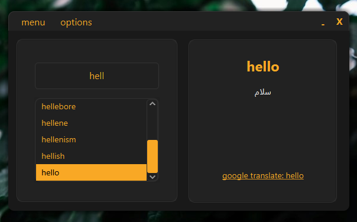

# about this project
ZenDictionary was one of my collage projects built using JavaFx and Java 8. It’s a smart English-Persian and Persian-English Dictionary.
The IDE I used is Apache netbeans. You can import the project in IDE and try it for yourself or create a jar file.
**Note that entofa.csv and fatoen.csv files are needed to exist in running directory for program to run by intended!**
Details of this program:
- Fantastic and custom made UI thanks to JavaFx and CSS
- Detecting language based on user input and auto translate to target language without pressing any buttons
- Suggesting words in a second
- Link for google translate
- Add , remove and update words using word manager by ease
- Bulk translate: good for translating paragraphs… I guess? (We had to use trees in such way OK? leave me alone!)
- Compressing using Huffman encoding (removed. Too slow!)
- Always on top mode
- Hunter mode: scan for new words in clipboard and auto translate them
- Translate word by hitting enter
- Smart save after any change in words

Note that this program is build in a short amount of time and could contain bugs so feel free to report them!